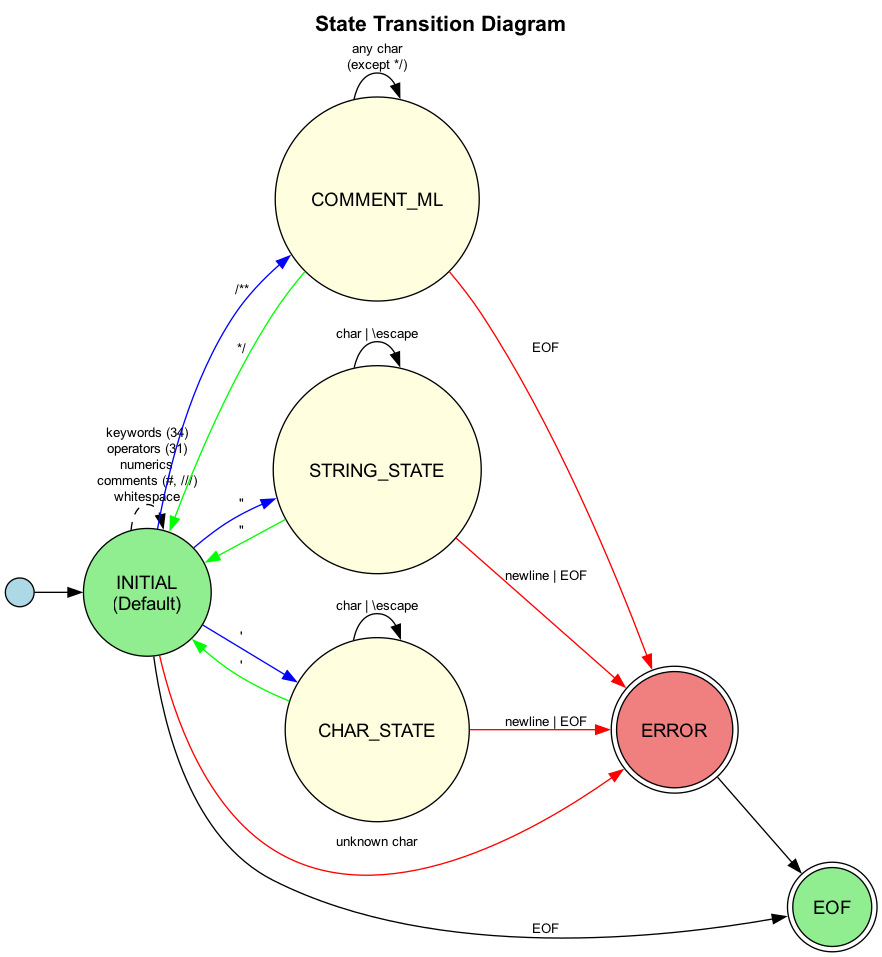
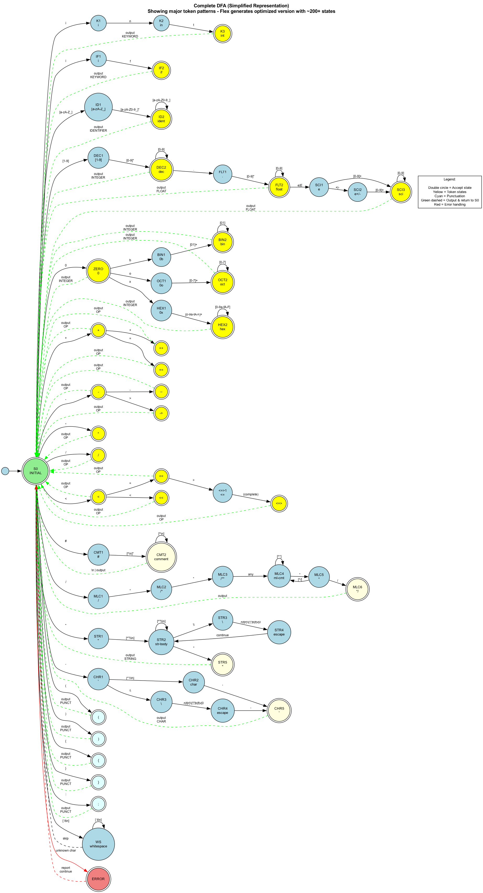

## Lexer Features

**Keywords:** int, short, float, char, void, bool, struct, signed, unsigned, extern, static, if, else, for, while, repeat, until, switch, case, default, break, continue, return, sizeof, begin, end, true, false

**Numeric Literals:**
- Decimal: 42
- Binary: 0b1010
- Octal: 0o777
- Hexadecimal: 0xDEAD
- Float: 3.14, .5, 5., 1.5e10, 3.14e-2

**Operators:** +, -, ^, /, %, =, +=, -=, ^=, /=, %=, ++, --, ==, !=, <, <=, >, >=, <=>, &&, ||, !, &, |, ^^, ~, <<, >>, ->, *, &

**Comments:** `#` single-line, `///` doc comments, `/** multi-line **/`

Comments are skipped by the lexer and still contribute to position tracking.

**Escape Sequences:** \n, \t, \r, \\, \', \", \b, \f, \v, \0

**Error Detection:** Position tracking, unterminated strings/chars/comments, invalid escape sequences

## Lexer States

The lexer uses 4 states for handling multi-line constructs:
- INITIAL: Default state for token recognition
- COMMENT_ML: Multi-line comment processing
- STRING_STATE: String literal processing
- CHAR_STATE: Character literal processing

Note: This shows state management flow, not the actual token recognition DFA.

**Detailed Token Recognition DFA:**

This shows the internal automaton structure for token recognition generated by Flex.